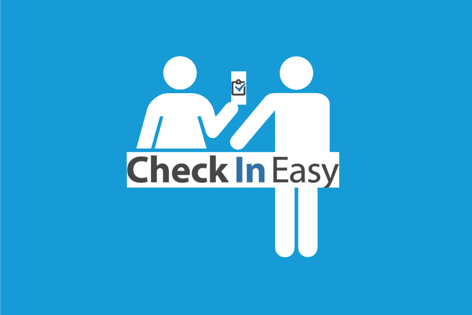

##  "Check-In Easy" - iOS App for Brown University John Carter Library

<a href="https://docs.google.com/presentation/d/1ZryA1KyADO0cJw8wEY_STLJKt9nLCb6PbitWlowuMTY/pub?start=true&loop=true&delayms=60000"></a>

Develop an iOS App to help Brown University John Carter Library keep track of visitor info and check-in history. Provide neat and functional UI for quick checkins. Store divergent profiles for each visitor and group. Librarians have higher access to view visitor and group’s visiting history. Personal info stored securely.


```js
Tech and Skills used: 

a) Server: Node.js, Amazon AWS
b) Database: SQLite 
c) iOS App: Swift

